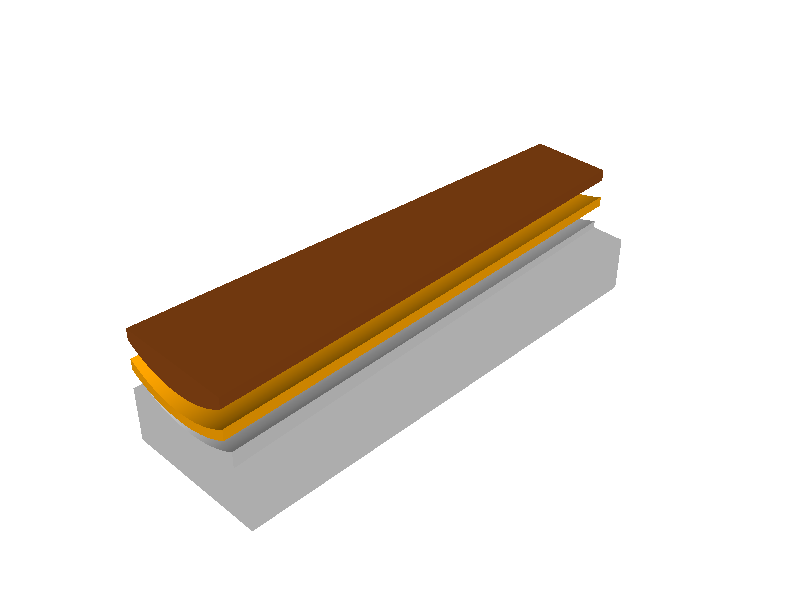

# Viola da gamba fingerboard planing jig



<p align="center"><em>Exploded view: printed jig, 5 mm foam liner, and nominal fingerboard.</em></p>

A parametric [build123d](https://build123d.readthedocs.io/) model for a
3D-printed jig that holds a viola da gamba fingerboard while its underside is
planed.

The curved face of the fingerboard rests on a 5 mm foam liner. The printed
cradle supports the foam without raised side lips or end stops, leaving the
plane unobstructed and allowing the foam to overhang instead of requiring an
exact tapered cut. A 30 mm-deep rectangular base provides parallel faces for
clamping in a vice.

## Default dimensions

| Parameter | Value |
| --- | ---: |
| Fingerboard radius | 55 mm |
| Foam thickness | 5 mm |
| Hard cradle radius | 60 mm |
| Fingerboard length | 256 mm |
| Printed jig length | 250 mm |
| Fingerboard width at nut | 42 mm |
| Fingerboard width at bridge end | 62 mm |
| Fit clearance | 0.25 mm per side |
| Vice-clamping depth | 30 mm minimum |
| Overall printed size | 250 × 78.5 × 38.7 mm |

The shorter jig fits within the Bambu Lab P1S build volume. A centred 256 mm
fingerboard overhangs the two open ends by 3 mm each.

## Generate the model

Install the dependencies with [uv](https://docs.astral.sh/uv/):

```sh
uv sync --extra viewer
```

Generate the STL and STEP files:

```sh
uv run python fingerboard_jig.py
```

The files are written to:

- `build/fingerboard_jig.stl`
- `build/fingerboard_jig.step`

To send the jig, foam, and fingerboard reference objects to OCP CAD Viewer:

```sh
uv run python fingerboard_jig.py --show
```

In the viewer, the jig is grey, the foam is translucent orange, and the
fingerboard reference is translucent brown.

## Customise it

Every important dimension is exposed as a command-line option. For example:

```sh
uv run python fingerboard_jig.py \
  --radius 60 \
  --foam-thickness 3 \
  --jig-length 245 \
  --clearance 0.35 \
  --show
```

Run the following command for the complete parameter list:

```sh
uv run python fingerboard_jig.py --help
```

The viewer's nominal fingerboard has a 6 mm edge thickness solely to make the
reference body visible. Its curved contact face, length, and tapered outline
use the specified dimensions; the face being planed should be adjusted to the
actual instrument during setup.

## Printing and use

- Print with the broad flat base on the build plate.
- The default geometry is a single watertight solid and requires no generated
  support material.
- Lay an oversized sheet of 5 mm foam over the cradle and allow it to overhang
  the lip-free edges.
- Centre the fingerboard to leave approximately 3 mm overhang at each end.
- Clamp only the parallel 30 mm base in the vice, keeping the plane path clear.

Always verify the fit gently before clamping an instrument part. Adjust
`--clearance` and `--foam-thickness` for the actual foam compression and printer
tolerances.
